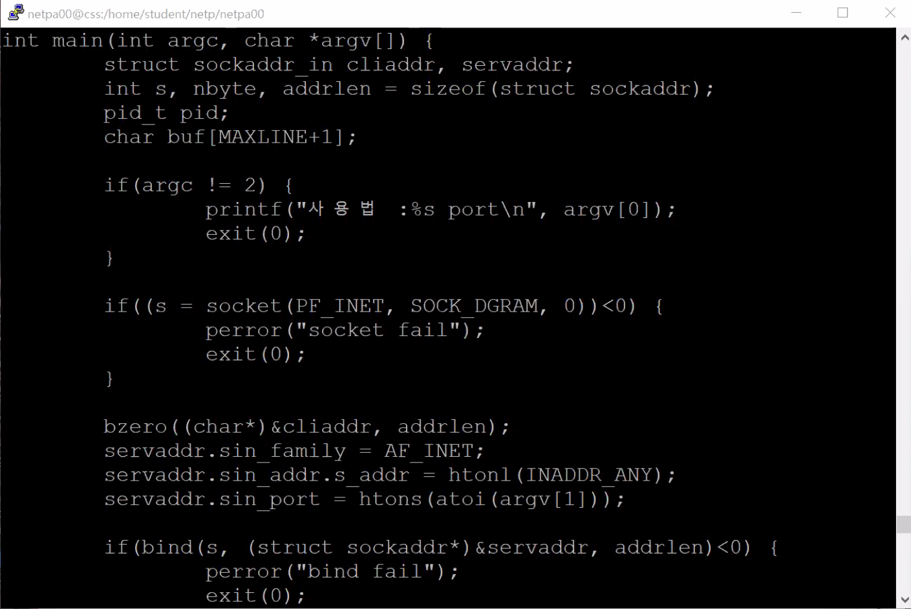
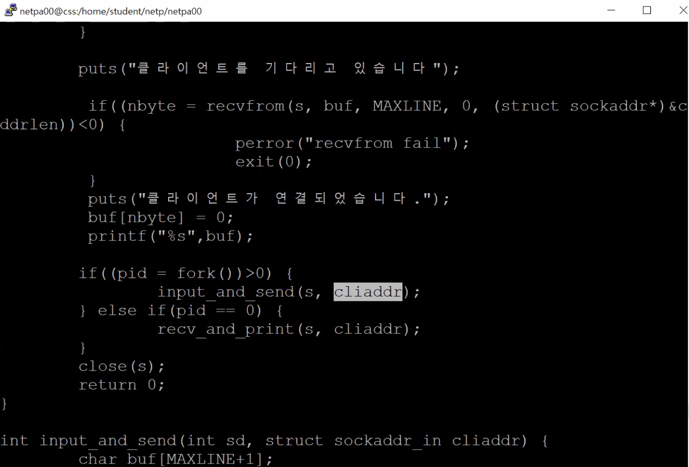
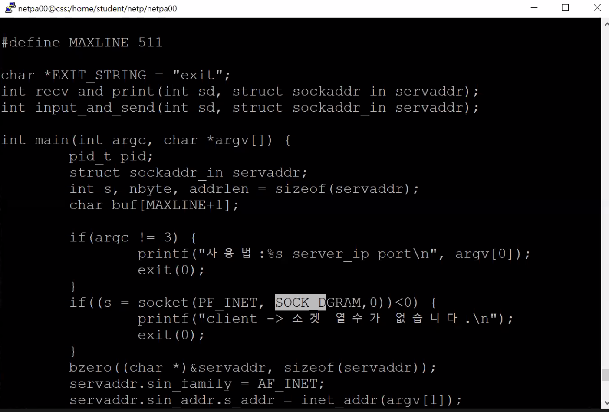
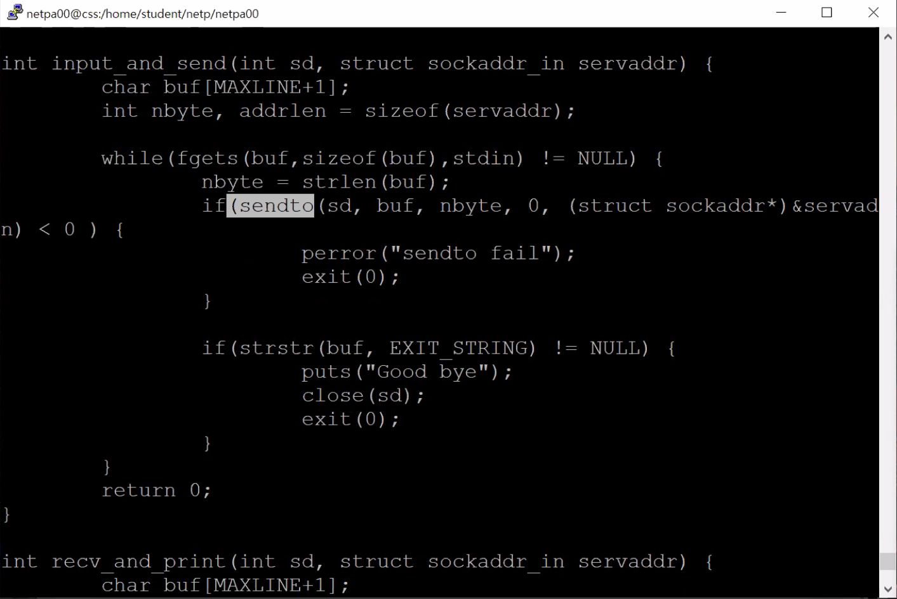
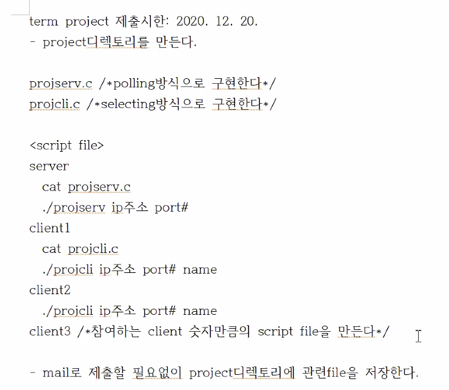

# Chapter 4. 고급 소켓 프로그래밍

* 3장에서 talk server는 서버와 클라이언트가 어떻게 메시지를 주고 받는지 소개하기 위해!

<br/>

### 4.1 다중처리 기술

* 여러 작업을 병행하여 처리하는 기법
* context switching : 수행하는 프로세스를 변경하는 작업

<br/>

#### 멀티 프로세스

* 독립적으로 처리할 작업의 수 만큼 프로세스를 생성
* 장점
  * 간편한 구현
* 단점
  * 프로세스 증가로 인한 프로그램 성능 저하 (context switching)
  * 프로세스간 데이터 공유가 불편함
  * 프로세스간 데이터 공유를 위해 IPC를 사용해야 함 (Inter Process Communication)
  * IPC 사용시 프로그램이 복잡해진다.

<br/>

#### 멀티스레드

* 프로세스 내에서 독립적으로 실행되는 작업 단위
* 프로세스 내에서 여러 스레드를 실행시켰을 경우 외부에선 하나의 프로세스로 취급
* 스레드는 프로세스의 이미지를 복사해서 사용하지 않고, 원래 프로세스 이미지를 같이 사용
  * 원래 이미지를 공유 한다!
  * 생성된 스레드용 스택 영역이 별도로 배정
    * 스레드간 스택은 공유되지 않음!
* 데이터 공유
  * 프로세스 이미지를 공유하므로 전역변수를 같이 사용 But 지역변수는 같이 사용 X
    * 데이터 동기화 문제 발생

<br/>

#### 다중처리 기술의 선택

* 멀티프로세스
* 나중에 다시 공부하고 정리하자.. 

<br/>

#### 다중화

* 하나의 프로세스에서 다중처리를 하기 위해서는 블록되면 안된다!

<br/>

#### 폴링

* 서버가 클라이언트한테 처리할 거 있니? 하고 물어보는 것.
* 하지만 block이 되면 안되기 때문에 소켓을 none block 모드로 설정
* 여러 클라이언트가 고르게 트래픽을 발생 시키는 경우에 적합하다.

<br/>

#### 셀렉팅

* 폴링과 반대 개념으로 동작
* 서버는 select() 함수에서 블록이 되었다가, 클라이언트에서 요청이 오면 리턴을 한다.
* 비동기(asynchronous) 모드로 변경하여 사용한다.

<br/>

#### 인터럽트

* 프로세스가 어떤 일을 하고 있다가 인터럽트가 발생하면, 작업을 중단하고 인터럽트를 처리한다.
* 채팅 프로그램에서 이 방식은 바람직하지 않다고 합니다.

<br/>

#### 4.1.3 다중처리 예

#### 멀티 프로세스형 서버 프로그램

<br/>

#### 폴링형 서버 프로그램

* 클라이언트들이 공평하게 사용하고 싶을 때 적합

<br/>

#### 셀렉팅형 서버 프로그램

* 선택된 일부 프로세스만 사용할 때..?? 다시 정리

<br/>

#### 인터럽트형 서버 프로그램

* 인터럽트 발생!

<br/>

### 4.2 소켓의 동작 모드

소켓의 동작 모드에는 다음 세 가지가 있다.

> - 블록(blocking) 모드
>
> * 넌블록(non-blocking) 모드
> * 비동기(asynchronous) 모드

<br/>

#### 블록(blocking) 모드

* 소켓 처음 생성시 디폴트가 블록모드
* 즉, 시스템 콜 호출 시 수행 완료할 때 까지 프로세스가 멈춰있는 모드
* 블록될 수 있는 시스템 콜
  * listen(), connect(), accept(), recv(), send(), read(), write(), recvfrom(), sendto(), close()

<br/>

#### 넌블록(non-blocking) 모드

* 소켓 관련 시스템 콜에 대해 즉시 처리할 수 있든 없든  바로 결과를 리턴하여 블록되지 않게 하는 소켓
* 성공적으로 실행 될 때 까지 지속적으로 확인하는 방법(폴링)을 주로 사용

<br/>

#### 비동기(asynchronous) 모드

* 소켓에서 I/O 변화가 발생하면 그 사실을 응용 프로그램에게 알려 원하는 동작을 실행시키는 모드
* select(), fcntl()을 이용하여 signal-driven I/O 모드로 변환 즉, 소켓을 비동기 모드로 변환
* 소켓 전체를 대상으로 select()를 호출해 두면, 임의의 소켓에서 I/O 변화가 발생할 때 select()가 리턴된다.
* 이 때 리턴된 값을 확인해 원하는 작업을 수행하는 것이다.

<br/>

### 공지사항!

1. 기말고사. 12월 17일 목요일 아침 9시에 대면시험!

2. 채팅 서버 구현하고 나면 PC끼리 메시지 주고받는게 가능하기 때문에, term project 부여...

   어떠한 메시지를 주고 받는 것인가? 를 정해서 제안하자.

   두 참가자가 가위바위보 게임을 한다. 가장 간단한 프로그램.

   제안서 A4 한 장 정도! 20줄 정도. 어떤 프로그램을 만들겠다!

<br/>

#### 지난 퀴즈 복습

* 서버 프로그램




<br/>



cliaddr을 굳이 줄 필요 없다고??

종료 문자열 수신 필요 없다~! 지우자.


talk serv 실행시키고

cli 실행..

<br/>

이건 크라이언트



<br/>



아니면 클라이언트 측에서 sendto 함수를 한 번 호출하고, 정크 메시지를 줌으로서 서버에서 출력을 할 필요는 없다.

<br/>

<br/>

### 4.3 비동기형 채팅 프로그램

#### 4.3.1 채팅 서버 프로그램 구조

* 서버는 먼저 **socket()**을 호출해 채팅 참가 요청을 받아들일 **연결용(listening) 소켓** 개설
* 이 소켓과 자신의 소켓주소 **bind()**
* 연결용 소켓 대상으로 **select()** 호출
* 연결 요청이 오면 **accept()** 호출하여 참가요청 처리
* 반환된 새 **통신용(connected) 소켓**을 **참가자 리스트(clisock_list[])**에 등록
* 연결용과 통신용 소켓 대상으로 **select()** 호출 (I/O 변화 발생시 select() 반환)
* 응용 프로그램에서, 어떤 소켓의 어떤 I/O 변화가 발생했는지 확인
  * 연결용 소켓 I/O 변화 시 새로운 참가요청
  * 통신용 소켓 I/O 변화 시 채팅 메시지 전송
* 서버 프로그램은 이렇게 **연결용 소켓**을 포함한 **모든 통신용 소켓**에 대해 **발생하는 I/O 변화를 감지**하도록 **select()**를 호출하여야 한다.

<br/>

#### 4.3.2 select()

#### select() 사용 문법

```c
int select() {
    int maxfdp1,			// 최대 파일(및 소켓) 번호크기 + 1
    fd_set *readfds,		// 읽기 상태 변화를 감지할 소켓 지정
    fd_set *writefds,		// 쓰기 상태 변화를 감지할 소켓 지정
    fd_set *exceptfds,    	// 예외 상태 변화를 감지할 소켓 지정
    struct timeval *tvptr);	// select() 시스템 콜이 기다리는 시간
```

* maxfdp1 : 현재 개설된 소켓 번호중 가장 큰 소켓번호 +1의 값을 입력하여야 한다.
* fd_set(file descriptor set) 타입의 인자 readfds, writefds, exceptfds는 각각 읽기, 쓰기, 예외 발생 등 I/O 변화가 발생했을 때 감지할 대상이 되는 소켓들을 지정하는 배열형 구조체다.
* tvptr : select()가 기다리는 시간을 지정.
  * NULL일 경우 I/O 변화 발생 전까지 무한히 대기
  * 0인 경우 바로 리턴
* **select가 return 하는 경우 ★**
  * -1 : 오류 발생
  * 0 : 파일 디스크립터에 아무런 변화 없음
  * **0이상 : 변화가 발생한 파일 디스크립터의 수**
* **select 함수 호출이 끝나면, 변화가 생긴 fd 위치를 제외한 나머지 위치의 비트들이 0으로 초기화된다.** ★★★

<br/>

#### fd_set 구조체

* 1bit짜리 array라고 생각하면 된다.
* 인덱스의 값이 1로 세트되어 있는 경우, 해당 파일 디스크립터의 I/O 변화를 감지한다는 뜻이다.
* 즉, readfds가 \[1]\[0]\[0][1]\[  ]... 로 셋팅되어 있다면, 0번(키보드 입력) 3번 fd의 변화를 감지한다.

<br/>

#### 이를 활용하기 위해 제공되는 매크로 함수들

```c
FD_ZERO(fd_set *fdset)			// fdset의 모든 비트를 0으로 세트
FD_SET(int fd, fd_set *fdset)	// fdset중 소켓 fd에 해당하는 비트를 1로 세트
FD_CLR(int fd, fd_set *fdset)	// fdset중 소켓 fd에 해당하는 비트를 0으로 세트
FD_ISSET(int fd, fd_set *fdset)	// fdset중 소켓 fd에 해당하는 비트가 세트되어있으면 양수 값을 리턴
```

* 특정 소켓이 **0으로 세팅**되어 있다는 말은, **해당 소켓에 대해 I/O 변화를 감지하지 않겠다**는 뜻이다.
* 즉, **소켓 fd**에 해당하는 비트를 **1로 세트**했다는 것은, **해당 소켓의 I/O 변화를 감지하겠다**는 뜻이다.
* 이 때, **ISSET**을 이용해 **어떤 소켓에서 I/O 변화가 발생**해서 **select()**문이 리턴되었는지 알 수 있다.

<br/>

#### Select call을 위해 I/O를 감지할 소켓을 read_fds에 설정해주는 코드

```c
fd_set read_fds;
FD_ZERO(&read_fds);						// read_fds의 모든 소켓을 0으로 초기화
FD_SET(s, &read_fds);					// 연결용 소켓을 1로 셋팅
for(i=0; i<num_chat; i++) {				
    FD_SET(clisock_list[i], &read_fds);	// 모든 통신용 소켓을 1로 셋팅
}
```

<br/>

#### Select  및 I/O 변화 체크

```c
select(maxfdp1, &read_fds, NULL, NULL, NULL);

...

if (FD_ISSET(s, &read_fds)) {
    // 연결용 소켓 s에서 I/O 변화가 발생한 경우, 채팅 참가 신청 처리
}

// 클라이언트 소켓번호 배열 client[]에서 소켓 변화가 있는지 차례로 검색
for (i=0; i<num_chat; i++) {
    if (FD_ISSET(clisock_list[i], &read_fds)) {
        // 통신용 소켓 clisock_list[i]에서 I/O 변화가 있는 경우,
        // 채팅 메시지 수신이므로 모든 참가자에게 채팅 메시지를 발송
    }
}
```

<br/>

#### 채팅 서비스 실행 부분

... 말고 바로 코드를 보자.

<br/>

#### TCP_chat 서버

```c
//--------------------------------------------------------------------
// 파일명 : tcp_chatserv1.c
// 기  능 : 채팅 참가자 관리, 채팅 메시지 수신 및 방송
// 수  정 : 자신에게는 메시지 보내지 않기, maxfdp1 필요한 곳에만 호출
// 컴파일 : cc -o tcp_chatserv1 tcp_chatserv1.c
// 사용법 : tcp_chatserv 5008
//-------------------------------------------------------------------
#include <stdio.h>
#include <stdlib.h>
#include <string.h>
#include <fcntl.h>
#include <netdb.h>

#define MAXLINE 511
#define MAX_SOCK 1024

char *EXIT_STRING = "exit"; // 클라이언트의 종료 요청 문자열
char *START_STRING = "Connected to chat_server \n"; // 클라이언트 환영 메시지
int maxfdp1;				// 최대 소켓번호 +1
int num_chat = 0;			// 채팅 참가자 수
int clisock_list[MAX_SOCK];	// 채팅 참가자 소켓 번호 목록
int listen_sock;			// 서버의 리슨 소켓

void addClient(int s, struct sockaddr_in *newcliaddr); // 새로운 채팅 참가자 처리
int getmax();				// 최대 소켓번호 찾기
void removeClient(int s);	// 채팅 탈퇴 처리 함수
int tcp_listen(int host, int port, int backlog); // 소켓 생성 및 listen
void errquit(char *mesg) {	// 에러시 종료 함수
	perror(mesg);
	exit(1);
}

int main(int argc, char* argv[]) {
	struct sockaddr_in cliaddr;
	char buf[MAXLINE+1];
	int i, j, nbyte, accp_sock, addrlen = sizeof(struct sockaddr_in);
	fd_set read_fds;	// 읽기를 감지할 fd_set 구조체

	if (argc != 2) {
		printf("사용법 : %s port\n", argv[0]);
		exit(0);
	}

	// tcp_listen(host, port, backlog) 함수 호출
	listen_sock = tcp_listen(INADDR_ANY, atoi(argv[1]), 5);
	
	maxfdp1 = listen_sock+1; // maxfdp1 초기값 대입을 위해 호출
	while (1) {
		FD_ZERO(&read_fds);
		FD_SET(listen_sock, &read_fds);
		for (i=0; i<num_chat; i++) {
			FD_SET(clisock_list[i], &read_fds);
	       	}
		puts("wait for client");
		// 여기까지 하면 client 기다릴 준비 완료
		if (select(maxfdp1, &read_fds, NULL, NULL, NULL) < 0) { // block
			errquit("select fail");
		} // select return시 어떤 소켓에서 변화가 생겼다는 뜻!
	
		// listen_sock의 변화이면 새 클라이언트 추가
		if (FD_ISSET(listen_sock, &read_fds)) {	
			accp_sock = accept(listen_sock, (struct sockaddr*)&cliaddr, &addrlen);
			if (accp_sock == -1) {
				errquit("accept fail");
			}
			addClient(accp_sock, &cliaddr);
			send(accp_sock, START_STRING, strlen(START_STRING), 0);
			printf("%d번째 사용자 추가.\n", num_chat);
		}

		// 클라이언트가 보낸 메시지를 모든 클라이언트에게 방송
		for (i=0; i<num_chat; i++) {
			// 특정 클라이언트의 소켓에 변화가 있으면
			if (FD_ISSET(clisock_list[i], &read_fds)) {
				nbyte = recv(clisock_list[i], buf, MAXLINE, 0);
				if (nbyte <= 0) { // 메시지 문제 발생시
					removeClient(i); // 클라이언트 중료
					continue;
				}
				buf[nbyte] = 0;
				// 종료문자 처리
				if (strstr(buf, EXIT_STRING) != NULL) {
					removeClient(i); // 클라이언트 종료
					continue;
				}
				// 모든 채팅 참가자에게 메시지 방송
				for (j=0; j<num_chat; j++) {
					if (j == i) // 내가 보낸 메시지는 수신하면 안되지! loopback 방지
						continue;
					send(clisock_list[j], buf, nbyte, 0);
				}
				printf("%s\n", buf);
			}
		}
	} // end of while
	return 0;
}


// 새로운 채팅 참가자 처리
void addClient(int s, struct sockaddr_in *newcliaddr) {
	char buf[20];
	inet_ntop(AF_INET, &newcliaddr->sin_addr, buf, sizeof(buf));
	printf("new client: %s\n", buf); //, %d\n", buf, ntohs(newcliaddr->sin_port));
	// 채팅 클라이언트 목록에 추가
	clisock_list[num_chat] = s;
	num_chat++;
	maxfdp1 = getmax() + 1; // maxfdp1 재계산
}

// 최대 소켓번호 찾기
int getmax() {
	// Minimum 소켓 번호는 가장 먼저 생성된 listen_sock
	int max = listen_sock;
	int i;
	for (i=0; i<num_chat; i++) {
		if (clisock_list[i] > max) {
			max = clisock_list[i];
		}
	}
	return max;
}

// 채팅 탈퇴 처리 함수
void removeClient(int s) {
	close(clisock_list[s]);
	if (s != num_chat-1) {
		clisock_list[s] = clisock_list[num_chat-1];
	} else { // s가 마지막에 들어온 소켓이었을 경우
		maxfdp1 = getmax() + 1; // maxfdp1 재계산
	}
	num_chat--;
	printf("채팅 참가자 1명 탈퇴. 현재 참가자 수 = %d\n", num_chat);
}

// 소켓 생성 및 listen
int tcp_listen(int host, int port, int backlog){
	int sd;
	struct sockaddr_in servaddr;

	sd = socket(AF_INET, SOCK_STREAM, 0);
	if (sd == -1) {
		errquit("socket fail");
	}
	// servaddr 구조체의 내용 셋팅
	bzero((char *)&servaddr, sizeof(servaddr));
	servaddr.sin_family = AF_INET;
	servaddr.sin_addr.s_addr = htonl(host);
	servaddr.sin_port = htons(port);

	if (bind(sd, (struct sockaddr*)&servaddr, sizeof(servaddr)) < 0) {
		errquit("bind fail");
	}

	// 클라이언트로부터 연결 요청을 기다림
	listen(sd, backlog);
	return sd;
}
```

<br/>

★ maxfdp1 을 1로 하면 왜 안되나? 적은 값을 쓰면 왜 안되나? 이 문제에 답을 하기 위해 알아야할 것

* maxfdp1은 select에서 첫 번째 인자로 준다.
* 이 때, maxfdp1은 readfds 배열의 크기를 결정해준다.

<br/>

#### TCP_chat 클라이언트

```c
//--------------------------------------------------------
// 파일명 : tcp_chatcli.c
// 기  능 : 서버에 접속한 후 키보드의 입력을 서버로 전달하고,
// 		   서버로부터 오는 메시지를 화면에 출력한다
// 컴파일 : cc -o tcp_chatcli tcp_chatcli.c
// 사용법 : tcp_chatcli 127.0.0.1 4001 name
//--------------------------------------------------------
#include <stdio.h>
#include <stdlib.h>
#include <string.h>
#include <fcntl.h>
#include <netdb.h>

#define MAXLINE 1000
#define NAME_LEN 20

char *EXIT_STRING = "exit";
int tcp_connect(int af, char *servip, unsigned short port); // 소켓 생성 및 서버 연결, 생성된 소켓 리턴
void errquit(char *mesg) {	// 에러시 종료 함수
	perror(mesg);
	exit(1);
}

int main(int argc, char* argv[]) {
	char bufall[MAXLINE + NAME_LEN], // 이름 + 메시지를 위한 버퍼
	     *bufmsg;	// bufall에서 메시지 부분의 포인터
	int maxfdp1,	// 최대 소켓 디스크립터
	    s,		// 소켓
	    namelen;	// 이름의 길이
	fd_set read_fds;// 읽기를 감지할 fd_set 구조체

	if(argc != 4) {
		printf("사용법 : %s server_ip port name\n", argv[0]);
		exit(0);
	}

	sprintf(bufall, "[%s] : ", argv[3]);	// bufall의 앞부분에 이름을 저장
	namelen = strlen(bufall);
	bufmsg = bufall + namelen;	// 메시지 시작부분 지정 (초기화)

	s = tcp_connect(AF_INET, argv[1], atoi(argv[2]));
	if(s == -1)
		errquit("tcp_connect fail");

	puts("서버에 접속되었습니다.");
	maxfdp1 = s+1; // 고정 되어있다.
	FD_ZERO(&read_fds);

	while(1) {
		FD_SET(0, &read_fds); // 키보드 fd 초기화
		FD_SET(s, &read_fds); // 수신 fd 초기화
		// 여기까지 하면 select 준비 완료
		if(select(maxfdp1, &read_fds, NULL, NULL, NULL) < 0) {
			errquit("select fail");
		}
		// 서버로부터 수신한 메시지이면 - 소켓 s의 read_fds 변화이면
		if(FD_ISSET(s, &read_fds)) {
			int nbyte;
			if ((nbyte = recv(s, bufmsg, MAXLINE, 0)) > 0) {
				bufmsg[nbyte] = 0;
				printf("%s\n", bufmsg); // 화면 출력
			}
		}

		// 키보드로부터 입력이면 - 0번 fd의 read_fds 변화이면
		if(FD_ISSET(0, &read_fds)) {
			if(fgets(bufmsg, MAXLINE, stdin)) {
				if(send(s, bufall, namelen + strlen(bufmsg), 0) < 0)
					puts("Error : Write error on socket.");
				if(strstr(bufmsg, EXIT_STRING) != NULL) {
					puts("Good bye.");
					close(s);
					exit(0);
				}
			}
		}

	} // end of while
	return 0;
}

// 소켓 생성 및 서버 연결, 생성된 소켓 리턴
int tcp_connect(int af, char *servip, unsigned short port) { 
	struct sockaddr_in servaddr;
	int s;

	// 소켓 생성
	if ((s = socket(AF_INET, SOCK_STREAM, 0)) < 0) {
		return -1;
	}

	// 채팅 서버의 소켓 주소 구조체 servaddr 초기화
	bzero((char *)&servaddr, sizeof(servaddr));
	servaddr.sin_family = af;
	inet_pton(AF_INET, servip, &servaddr.sin_addr);
    //servaddr.sin_addr.s_addr = inet_addr(servip);
	servaddr.sin_port = htons(port);

	// connect 콜
	if (connect(s, (struct sockaddr*)&servaddr, sizeof(servaddr)) < 0) {
		return -1;
	}
	return s;
}
```

<br/>

<br/>

### 4.4 폴링형 채팅 프로그램

#### 4.4.1 fcntl()

* fcntl() 콜을 이용해 소켓을 넌블록 모드나 비동기 모드로 바꿀 수 있다.
  * 넌블록 모드로 설정
  * 비동기 모드로 설정
  * 소유자 설정 및 현재 소유자 얻어오기

<br/>

#### fcntl() 의 사용 문법

```c
int fcntl(int fd, int cmd, long flag);
```

* fd : 모드 변경을 원하는 소켓 디스크립터
* cmd : 명령
  * F_SETFL : flag 셋팅
  * F_GETFL : flag 읽기
* flag : 모드 설정
  * O_NONBLOCK : 넌블록 모드 설정
  * O_ASYNC : 비동기 모드
* fcntl은, file control을 말한다!

<br/>

#### 소켓을 넌블록으로 설정하는 과정

```c
int val;
if ((val = fcntl(sock_fd, F_GETFL, 0)) <0) // 셋팅된 플래그 읽어오기
    exit(1);
val |= O_NONBLOCK; // 기존에 설정된 값이 지워지는걸 방지하기 위해 or로 '추가'하는 명령
if ((fcntl, F_SETFL, val) < 0)
    exit(1);
```

* 추가할 때는 읽어온 값에 | 로 더해서 SET 하고, 확인할 때는 &로 확인한다.

<br/>

#### 4.4.2 폴링형 채팅 서버

#### 넌블록 모드

* 폴링형에서는 fcntl()을 이용해 소켓을 넌블록 모드로 설정한다.
* 넌블록 모드의 소켓에 대해서는 시스템 콜을 호출해도 block 되지 않고 바로 리턴한다.
* 이 때 수행 되었을 수도, 그냥 리턴되었을 수도 있다.
* 그 값에 따라 정상수행 / 에러 / 즉시리턴 이 확인된다.
* 예를 들어 리턴 값이 0이면 정상적 수행, -1이면 에러이다.
* 그러나 에러 코드가 EWOULDBLOCK이면 즉시 리턴 된 것이다.
* 이 경우에는 에러를 무시하고 다음 작업을 진행하면 된다.

<br/>

#### 주의할 점

* **accept()를 호출한 연결용 소켓이 넌블록 상태여도, 연결 요청으로 인해 accept()가 반환한 통신용 소켓은 Default로 블록 모드이다. 즉, 필요하면 통신용 소켓을 명시적으로 넌블록 모드로 변경해줘야 한다.**

<br/>

#### 넌블록 모드인지 확인

```c
int val;
// 기존 플래그 값 얻어오기
val=fcntl(sockfd, F_GETFL, 0);

// 넌블록 모드인지 확인
if(val & O_NONBLOCK)
    return 0;
return -1;
```

* 앞서 설명한 것처럼, 반복해서 언급하면... **확인할 때는 &, 셋팅할 때는 |**

<br/>

#### 폴링형 채팅 서버

```c
//--------------------------------------------------------
// 파일명 : tcp_chatserv_nonb.c
// 기  능 : 채팅 참가자 관리, 채팅 메시지 수신 및 방송
// 컴파일 : cc -o tcp_chatserv_nonb tcp_chatserv_nonb.c
// 사용법 : tcp_chatserv_nonb 4001
//--------------------------------------------------------
#include <stdio.h>
#include <stdlib.h>
#include <string.h>
#include <fcntl.h>
#include <netdb.h>
#include <errno.h>

#define MAXLINE 511
#define MAX_SOCK 1024	// 솔라리스의 경우 64

char *EXIT_STRING = "exit"; // 클라이언트의 종료 요청 문자열
char *START_STRING = "Connected to chat_server \n"; // 클라이언트 환영 메시지
int num_chat = 0;		// 채팅 참가자 수
int clisock_list[MAX_SOCK];	// 채팅 참가자 소켓 번호 목록
int listen_sock;		// 서버의 리슨 소켓

void addClient(int s, struct sockaddr_in *newcliaddr); // 새로운 채팅 참가자 처리
void removeClient(int s);	// 채팅 탈퇴 처리 함수
int set_nonblock(int sockfd);	// 소켓을 넌블록으로 설정
int is_nonblock(int sockfd);	// 소켓이 넌블록 모드인지 확인
int tcp_listen(int host, int port, int backlog); // 소켓 생성 및 listen
void errquit(char *mesg) {	// 에러시 종료 함수
	perror(mesg);
	exit(1);
}

int main(int argc, char* argv[]) {
	struct sockaddr_in cliaddr;
	char buf[MAXLINE+1];
	int i, j, nbyte, count;
	int accp_sock, clilen, addrlen; // 이거 추가 해줘야 컴파일 에러 안나나?

	if(argc != 2) {
		printf("사용법 : %s port\n", argv[0]);
		exit(0);
	}

	// tcp_listen(host, port, backlog) 함수 호출
	listen_sock = tcp_listen(INADDR_ANY, atoi(argv[1]), 5);
	if (listen_sock == -1)
		errquit("tcp_listen fail");
   	if (set_nonblock(listen_sock) == -1)
		errquit("set_nonblock fail");
	
	for(count=0; ; count++) { // 무한 루프
		if (count == 100000) {
			putchar('.');
			fflush(stdout);
			count = 0;
		}
		accp_sock = accept(listen_sock, (struct sockaddr*)&cliaddr, &clilen);
		if(accp_sock == -1 && errno != EWOULDBLOCK) {
			errquit("accept fail");
		} else if (accp_sock > 0) {
			// 통신용 소켓은 넌블록 모드가 아님
			if (set_nonblock(accp_sock) < 0) {
				errquit("set_nonblock fail");
			}
			addClient(accp_sock, &cliaddr);
			send(accp_sock, START_STRING, strlen(START_STRING), 0);
			printf("%d번째 사용자 추가.\n", num_chat);
		}
		
		// 클라이언트가 보낸 메시지를 모든 클라이언트에게 방송
		for(i=0; i<num_chat; i++) {
			errno = 0; 
			nbyte = recv(clisock_list[i], buf, MAXLINE, 0);
			if (nbyte == 0) { // 메시지 문제 발생시
				removeClient(i); // 클라이언트 중료
				continue;
			}
			else if (nbyte == -1 && errno == EWOULDBLOCK)
				continue;
			// 종료문자 처리
			if(strstr(buf, EXIT_STRING) != NULL) {
				removeClient(i); // 클라이언트 종료
				continue;
			}
			// 모든 채팅 참가자에게 메시지 방송
			buf[nbyte] = 0;
			for(j=0; j<num_chat; j++) {
				if(j == i) // 내가 보낸 메시지는 수신하면 안되져!
					continue;
				send(clisock_list[j], buf, nbyte, 0);
			}
			printf("%s\n", buf);
		}
	} // end of while
	return 0;
}


// 새로운 채팅 참가자 처리
void addClient(int s, struct sockaddr_in *newcliaddr) {
	char buf[20];
	inet_ntop(AF_INET, &newcliaddr->sin_addr, buf, sizeof(buf));
	printf("new client: %s\n", buf); //, %d\n", buf, ntohs(newcliaddr->sin_port));
	// 채팅 클라이언트 목록에 추가
	clisock_list[num_chat] = s;
	num_chat++;
}

// 채팅 탈퇴 처리 함수
void removeClient(int i) {
	close(clisock_list[i]);
	if(i != num_chat-1) {
		clisock_list[i] = clisock_list[num_chat-1];
	}
	num_chat--;
	printf("채팅 참가자 1명 탈퇴. 현재 참가자 수 = %d\n", num_chat);
}

// 소켓이 넌블록 모드인지 확인
int is_nonblock(int sockfd) {
	int val;
	// 기존 플래그값 얻어오기
	val = fcntl(sockfd, F_GETFL, 0);
	// 넌블록 모드인지 확인
	if (val & O_NONBLOCK)
		return 0;
	return -1;
}

// 소켓을 넌블록으로 설정
int set_nonblock(int sockfd) {
	int val;
	// 기존의 플래그 값을 얻어온다
	val = fcntl(sockfd, F_GETFL, 0);
	if (fcntl(sockfd, F_SETFL, val | O_NONBLOCK) == -1)
		return -1;
	return 0;
}

// 소켓 생성 및 listen
int tcp_listen(int host, int port, int backlog){
	int sd;
	struct sockaddr_in servaddr;

	sd = socket(AF_INET, SOCK_STREAM, 0);
	if (sd == -1) {
		errquit("socket fail");
	}
	// servaddr 구조체의 내용 셋팅
	bzero((char *)&servaddr, sizeof(servaddr));
	servaddr.sin_family = AF_INET;
	servaddr.sin_addr.s_addr = htonl(host);
	servaddr.sin_port = htons(port);

	if (bind(sd, (struct sockaddr*)&servaddr, sizeof(servaddr)) < 0) {
		errquit("bind fail");
	}

	// 클라이언트로부터 연결 요청을 기다림
	listen(sd, backlog);
	return sd;
}
```


### 임시 저장



스크립 파일이 여러 개 보여줘야 한다. 


혹시 maxfdp1이 readfdp를 검사할 때, readfdp 배열의 크기는 줄어들어야 하는데, 이미 제거된 클라이언트 소켓이 남아있어서 검사하게 될 가능성이 있는 것일까요???
그런 가능성때문에 로직상에 좋은 방법은 아닌것 같은데, 사실 해당 소켓이 "변화가 될 때" 감지를 하는거니까, select 하기 전에 항상 read_fds를 0으로 초기화를 해주는데 오류가 발생을 하나요??


## --------------------- 시험범위 ---------------------
